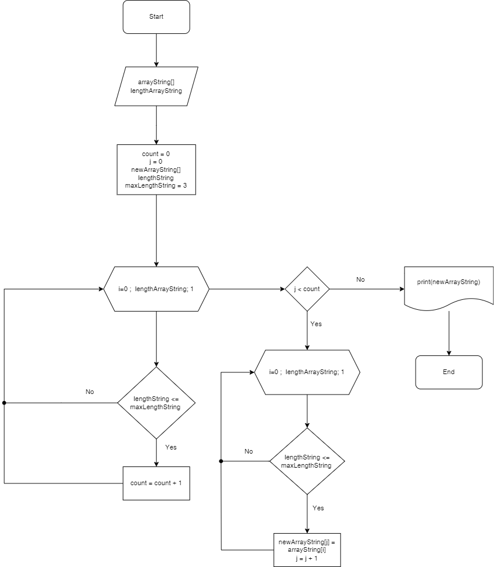

# Контрольная работа по основному блоку
## Условие задачи 
```
 Написать программу, которая из имеющегося массива строк формирует новый массив из строк, длина которых меньше, либо равна 3 символам. Первоначальный массив можно ввести с клавиатуры, либо задать на старте выполнения алгоритма. При решении не рекомендуется пользоваться коллекциями, лучше обойтись исключительно массивами.
 ```

 ## Решение
### Блок схема



На рисунке выше изображена блок-схема решения данной задачи. Программа работает по следующему алгоритму:
1. Запрашивает ввод данных пользователем: массив строк и длину массива
2. Считает строки массива, удовлетворяющих условию (длина символов меньше или равна 3)
3. Создаёт новый массив и добавляет строки в него
4. Выводит новый массив


### Пользовательский ввод данных
Чтобы пользователь понял, что нужно ввести данные необходимо сделать соотвествующий запрос. С помощью команды *Console.WriteLine* попросим пользователя ввести длину массива и сохраним полученное значение в переменную *lengthArrayString*
```
Console.WriteLine("Введите длину массива:");
lengthArrayString = Console.ReadLine();
```
Создадим массив строк длиной lengthArrayString
```
string [] arrayString = new string [lengthArrayString]
```

С помощью цикла *for* будем запрашивать пользователя ввод строк, пока переменная i < длины массива lengthArrayString

```
for (int i = 0 ; i < lengthArrayString; i++) {
    Console.WriteLine($"Введите строку {i + 1}:");
    arrayString[i] = Console.ReadLine();
}
```

